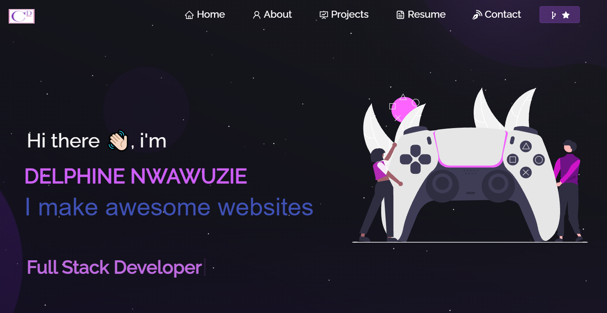

 &nbsp;
 &nbsp;
 &nbsp;

<!-- PROJECT PREVIEW -->
 

<h2 align="center">
  My Portfolio 
  
</h2>

  

 

<h3 align="center">
    🔹
    <a href="https://github.com/DelphineN/MyPortfolio/issues">Report Bug</a> &nbsp; &nbsp;
    🔹
    <a href="https://github.com/DelphineN/MyPortfolio/issues">Request Feature</a>
</h3>

### Forking this project

If someone wants to use this code on his own website, the answer is **YES** BUT please with credits !

Credit to [Soumyajit4419](https://github.com/soumyajit4419). Thanks!

## Built With

My personal portfolio which features some of my github projects as well as my resume and technical skills. 

This project was built using these technologies.

- CSS3
- Vercel

* [React JS](https://reactjs.org/)
* [Material UI](https://material-ui.com/)
* [Framer Motion](https://www.framer.com/motion/)
* [Node JS](https://nodejs.org/en/)
* [Express JS](https://expressjs.com/)
* [Visual Studio Code](https://code.visualstudio.com/)

## Features

**📖 Multi-Page Layout**

**🎨 Styled with React-Bootstrap and Css with easy to customize colors**

**📱 Fully Responsive**

## Getting Started

Clone down this repository. You will need `node.js` and `git` installed globally on your machine.

## 🛠 Installation and Setup Instructions

1. Installation: `npm install`

2. In the project directory, you can run: `npm start`

Runs the app in the development mode.\
Open [http://localhost:3000](http://localhost:3000) to view it in the browser.
The page will reload if you make edits.

<!-- CONTRIBUTING -->

## Contributing

Contributions are what make the open source community such an amazing place to learn, inspire, and create. Any contributions you make are **greatly appreciated**.

1. Fork the Project
2. Create your Feature Branch (`git checkout -b feature/AmazingFeature`)
3. Commit your Changes (`git commit -m 'Add some AmazingFeature'`)
4. Push to the Branch (`git push origin feature/AmazingFeature`)
5. Open a Pull Request

<!-- LICENSE -->

## License

Distributed under the MIT License. See `LICENSE` for more information.

